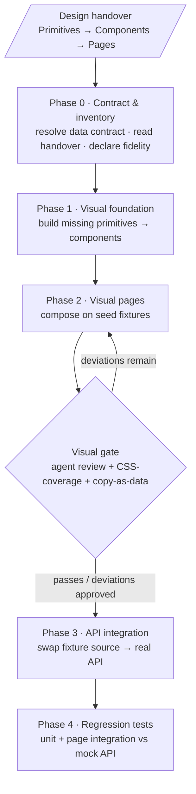

# Frontend Fidelity Workflow — Design

**Status: Approved — ready for planning**

## Problem

The Superpowers workflow (brainstorming → spec → writing-plans → executing-plans, with
test-driven-development and verification-before-completion as gates) produced an excellent
**backend** implementation for a NevaBridge feature module, but a **frontend** that functioned
yet diverged sharply from the high-fidelity wireframes produced in Claude Design.

A three-agent comparison (Claude, Codex, Cursor) of wireframe `03 Bug Scenarios` against the
shipped UI is captured in `analysis-unified.md`. Its core finding: this was not styling drift
but a stack of reinforcing process causes.

### Root causes (from analysis-unified.md)

1. **Mixed goals.** The agent was handed high-fidelity wireframes, a behaviour-heavy backend
   plan, a handover that licensed deviation, and an API contract missing the wireframe's
   identity fields — with no stated source-of-truth order.
2. **The plan demoted the wireframe.** Once a plan exists it becomes the source of truth;
   anything it paraphrased, summarised, or omitted was lost (copy, layout, columns, sections).
3. **No visual acceptance gate.** Functional/integration tests reward DOM presence and request
   shape, never spacing, typography, columns, or layout. "Green" masked a visually wrong UI.
4. **Structural data gap, silently normalised.** The wireframe modelled `name` + `description`;
   the shared type had neither. The agent substituted `initPrompt` and locked it in with tests
   instead of escalating.
5. **No owner of vertical visual completeness.** CSS classes were referenced but never defined;
   no task owned "port the wireframe CSS for this slice." Worker mode amplified narrow context.

## Goal for this session

Improve the workflow so future high-fidelity frontend work matches its wireframes, without
discarding the parts of the workflow that made the backend succeed.

## Questions resolved

| Question | Resolution |
| --- | --- |
| Fidelity intent | Declared **per-screen contract** (D1) |
| Architecture | Standalone **parallel** `writing-frontend-plans` skill, copied not referenced (D3) |
| Two-pass vs one | One skill, **visual-first phases** joined at the fixture seam (D5) — not two skills |
| Planning intensity | **Shorter/abstract** via *reference-don't-paraphrase*, not reduced rigor (D3, D8) |
| TDD for UI | **Not the driver** — blocking visual gate + mechanical checks; tests are Phase 4 regression (D6, D10) |
| Build order | **Inside-out**, inventory-driven from the handover (D4) |

## Decisions

### D1 — Fidelity is a declared, per-screen contract

Every screen declares its fidelity target up front — `pixel-target`,
`directionally-illustrative`, or `behavior-only` — and that declaration is the definition
of done. Pixel-target screens get the full visual acceptance gate; the others do not. This
attacks the #1 root cause (mixed/ambiguous goals) and spends fidelity effort only where it
is wanted.

### D2 — Wireframe demo data is a specification, not content to hardcode

The wireframe's dummy data specifies two things, and neither is "strings to reproduce":

1. **The data contract** — which fields the screen actually needs. Extracting this is how
   the missing `name` / `description` gap (cause 2.1) gets caught as an explicit early step
   instead of being silently normalised to `initPrompt`.
2. **The states to render** — filled list with N rows, empty state, long-text wrapping, etc.

Reproduce the demo data as a **named seed fixture** and render it through the *real, dynamic*
component; never hardcode demo values into the component. Pixel-fidelity is asserted by
screenshot-diffing the component when fed this fixture. The only later step is swapping the
fixture's data *source* for the real API — a data-source swap, not a component rewrite. No
"hardcode to pixel-perfect, then refactor to dynamic" two-step.

Exception: when the data contract does not exist yet (the `name` gap), resolve the field
shape first (add it, or document a derivation), then fixture — still never hardcode.

### D3 — A standalone `writing-frontend-plans` skill, copied not referenced

Frontend planning gets its own skill, a sibling to `writing-plans`. It is **standalone**: copy
the needed chunks from `writing-plans` rather than referencing it, so it is free to diverge
without being coupled to decisions it deliberately rejects. Intended divergences from
`writing-plans`:

- **No worker mode** — no orchestrator/subagent split.
- **No TDD as the per-task driver** — replaced by a verification model centered on a blocking
  visual gate (see D5).
- **Shorter, more abstract plans** — lean on living reference artifacts (handover doc,
  wireframe, seed fixtures) plus a mechanical gate, not prose enumeration of UI detail.
- **Explicit separation of visual work from logic/API-integration work.**

**Copy vs reference rule:** copy only *plan mechanics* (plan output format, task shape, commit
discipline, the plan-review loop) from `writing-plans`. Do **not** copy convention skills;
reference them by name per the `writing-skills` convention — `test-driven-development` for test
shape (D10) and `verification-before-completion` for the completion gate — so they cannot drift.

Guiding principle: freedom is granted on *implementation*, never on the *visual contract*.
Plans can be shorter because detail lives in reference artifacts and the gate, not because
rigor is reduced.

### D4 — Build order: inside-out, driven by a design handover doc

Build order is inside-out, anchored on a Claude Design → Claude Code **handover doc** ordered
**Primitives → Components → Pages**.

Because of the Claude Design ↔ Claude Code air-gap, this skill authors only the Claude Code
side and cannot enforce what Claude Design produces. Therefore the skill:

- **Specifies the ideal handover** so the user can prompt Claude Design for it: a doc ordered
  Primitives → Components → Pages, with all primitives/components defined. Claude Design works
  bottom-up (tokens → pages) and must be prompted *after* page creation to ensure every
  primitive and component referenced by the pages is actually defined.
- **Tells Claude Code** to read the handover, verify which primitives/components already exist
  in the codebase, plan to build the missing primitives/components **first**, then assemble
  pages.
- **Degrades gracefully** when the handover is incomplete. Phase 0 looks for the handover at
  the path the plan names (e.g. alongside the wireframes, or `docs/design/<feature>-handover.md`);
  if it is absent or partial, the agent inventories primitives/components from
  the design-system and wireframe sources the user identifies, and writes an explicit
  **inventory + gap list** into the plan's Phase 0. It proceeds on what it can build, but
  **stops and asks** when a page references a primitive/component that cannot be located or
  derived from available sources. A missing handover never silently blocks and never silently
  substitutes.

### D5 — Phase structure: visual-first on fixtures, then API integration

The skill separates visual work from logic/API work and orders them visual-first, joined at
the D2 fixture seam. This inverts the failed run (which wired the backend first and never
reached fidelity).

- **Phase 0 — Contract & inventory.** Resolve the wireframe↔API data contract (D2 exception),
  read the design handover, inventory the primitives/components the screens need, and declare
  per-screen fidelity (D1).
- **Phase 1 — Visual foundation.** Build/verify the missing primitives → components, verified
  in isolation (e.g. a component gallery).
- **Phase 2 — Visual pages.** Compose pages from components on **seed fixtures** (D2), behind
  the blocking page-level visual gate (D6).
- **Phase 3 — Logic/API integration.** Swap the fixture data *source* for the real API; wire
  behavior and loading/error/empty states.
- **Phase 4 — Regression tests.** Add the test suite covering page behaviors — navigation,
  state changes, actions. Testing model in D10.

### D6 — Verification model (replaces TDD)

No red-green test-first ritual: the definition of done for phases 1–2 is the blocking visual
gate below. Behavior and component logic are covered by the Phase 4 regression suite (D10),
which keeps TDD's test *shape* but not its test-first *ordering*.

- **Tooling prerequisite.** The gate requires rendering + screenshot capture: the agent serves
  the page/component (dev-server route or component-gallery route) on the seed fixture at the
  declared viewport and captures a screenshot via browser automation (e.g. Playwright headless
  or an available browser/MCP tool). If screenshot capture is unavailable in the environment,
  the gate degrades to a structured visual comparison the agent/user performs, but the
  mechanical checks below still run and still block. The skill must state this prerequisite.
- **Primary gate:** the agent renders the page on the seed fixture, compares the screenshot
  against the wireframe reference, and produces a deviation list. Completion is blocked while
  unapproved deviations remain (approved deviations per D8).
- **Enforced mechanical checks:** CSS-coverage (every `className` used has a defined rule →
  fixes the 1.9 undefined-class bug), copy-as-data (D8 owns the definition → fixes copy drift
  2.9), required layout structure present.
- **Optional regression guard:** once a screen is accepted, commit a PNG baseline + pixel-diff
  test to catch future regressions. This is a regression guard, not the primary fidelity gate,
  because the wireframe shell ≠ app shell makes strict pixel-equality brittle across the
  air-gap. It guards *visual* regressions; *behavioral* regressions are covered separately by
  the Phase 4 integration tests (D10).

### D7 — Ship a handover template, consume-or-derive, and close the loop

- The skill ships a concrete **design-handover template** (the Primitives→Components→Pages
  contract) the user can paste into Claude Design to demand a structured handover.
- Claude Code reads the handover when present and derives the inventory from
  design-system/wireframe files (flagging gaps) when it is absent or partial.
- **Close the loop:** extend the brainstorming skill's UX Brief (`ux-brief.md`) to request
  this handover from Claude Design. The UX Brief is the artifact the user controls, so it is
  the closest we can get to crossing the air-gap. Small companion edit.

### D8 — Plan-authoring principles (the reason plans can be shorter)

- **Reference, don't paraphrase.** UI plans point to the wireframe/handover ("match
  `ScenarioRow` in the handover, every column and label") instead of re-describing the UI in
  prose. This is the direct fix for the analysis's verdict that the plan demoted the wireframe;
  anything the plan paraphrases is lost.
- **Copy as data.** At Phase 0, extract every visible string into a frozen copy source
  (constants/fixture). The wireframe is the canonical source; the copy-as-data mechanical check
  (D6) asserts the rendered UI against it. Agents never re-write copy.
- **Approved-deviations table.** The visual gate (D6) emits a deviation list; deviations the
  design system requires but the wireframe omits (e.g. `Show archived`) are recorded as
  *approved* so reviewers don't read them as regressions and the agent doesn't silently blend
  conflicting sources.

### D9 — Shell / cross-screen authority

- Shared app chrome (nav, top bar, tenant footer) is a **component built in the Phase 1
  foundation**, not re-derived per screen.
- When per-entity wireframes disagree on shared chrome, the **latest wireframe is authoritative**
  for the shell; an earlier screen's shell is a draft, not a contract. This addresses the
  analysis's shell-vs-screen conflict (causes 1.1 / 2.4), where chrome built against wireframe
  01 permanently broke the side-by-side for wireframe 03.

### D10 — Testing model (Phase 4 regression suite)

Tests are regression coverage added after the build, not the build driver. Phase 4 adopts the
*test-shape* conventions of `test-driven-development` (real code, mock only at system
boundaries, integration-preferred, hardcoded expectations) but deliberately drops its
*test-first ordering* — the build is driven by the visual gate (D6), not by failing tests.
(`docs/testing.md` is about testing Superpowers skills with subagents and does not apply here.)

- **Pure, reusable components / extracted logic → unit tests.**
- **Page level → integration tests** that exercise our real code units together. Mock at the
  **HTTP boundary beneath the real typed API client** (e.g. Mock Service Worker / `nock`), so
  the client and the data-source code introduced in Phase 3 are exercised — never mock our own
  client or components, and never assert "function X was called." Follow the target codebase's
  existing integration tests when present.
- **The plan lists the scenarios to test** (navigation, state changes, actions), not how to
  implement the tests.
- Integration tests need **not** cover all code paths — especially not paths already covered by
  unit-tested components.
- **Prefer few, significant tests per page** over extensive coverage.

### D11 — Source-of-truth ranking (tie-break order)

When sources disagree, rank them — and stop and ask rather than silently blend (the analysis's
cause 2.7, which named "no stated source-of-truth order" as a root cause):

1. **Wireframe** — the rendered visual truth; what the screen must look like.
2. **Design system / tokens / primitives** — how to build it consistently.
3. **Design handover doc** — the primitive/component inventory and mapping.
4. **Plan prose** — must reference, never paraphrase away, the above (D8).
5. **Backend / API contract** — lowest for *visual* decisions; a gap here triggers
   stop-and-ask (D2), never silent substitution.

D1 sets how strictly the wireframe binds for a given screen; D9 resolves shared-shell
conflicts; this ranking covers the general case.

## Deliverables

1. **`skills/writing-frontend-plans/`** — the new standalone skill (D3) encoding the phase
   structure (D5), build order (D4), verification model (D6), plan-authoring principles (D8),
   shell authority (D9), and testing model (D10). Copies the needed mechanics from
   `writing-plans` rather than referencing it.
2. **Design-handover template** (D7) — a pasteable Primitives→Components→Pages contract,
   shipped with the skill.
3. **`skills/brainstorming/ux-brief.md` edit** (D7) — request the handover from Claude Design,
   closing the loop.

**Staging (for the planning transition):** Deliverables 1 + 2 form the first plan — the tryable
skill plus its handover template. Deliverable 3 (the `ux-brief.md` loop-closing edit) is a
small independent slice that can follow, since it touches a different skill.

Authoring follows the `writing-skills` skill for structure and the compression rubric. Per the
user's directive for this milestone, **skip the `writing-skills` skill-testing procedure** and
produce a draft the user can try directly.

## Non-goals

- This redesigns the **Superpowers skills/workflow**, not any NevaBridge feature. No NevaBridge
  code is in scope.
