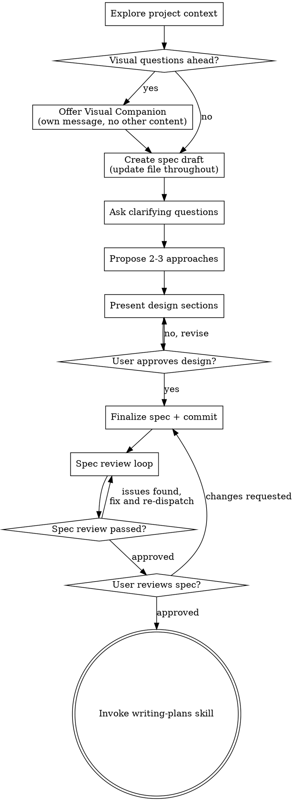

# Brainstorming Ideas Into Designs

Help turn ideas into fully formed designs and specs through natural collaborative dialogue.

Start by understanding the current project context, then ask questions one at a time to refine the idea. Once you understand what you're building, present the design and get user approval.

<HARD-GATE>
Do NOT invoke any implementation skill, write any code, scaffold any project, or take any implementation action until you have presented a design and the user has approved it. This applies to EVERY project regardless of perceived simplicity.
</HARD-GATE>

## Anti-Pattern: "This Is Too Simple To Need A Design"

Every project goes through this process. A todo list, a single-function utility, a config change — all of them. "Simple" projects are where unexamined assumptions cause the most wasted work. The design can be short (a few sentences for truly simple projects), but you MUST present it and get approval.

## Checklist

You MUST create a task for each of these items and complete them in order:

1. **Explore project context** — check files, docs, recent commits
2. **Offer visual companion** (if topic will involve visual questions) — this is its own message, not combined with a clarifying question. See the Visual Companion section below.
3. **Create spec draft file** — `docs/specs/YYYY-MM-DD-<topic>-design.md` (user override path if they prefer) with a clear **Status: Draft / not for implementation** at the top. See **Incremental spec persistence** below.
4. **Ask clarifying questions** — one at a time, understand purpose/constraints/success criteria; persist answers in the spec as you go
5. **Propose 2-3 approaches** — with trade-offs and your recommendation; record in the spec and reconcile earlier sections if choices change prior assumptions
6. **Present design** — in sections scaled to their complexity, get user approval after each section; mirror approved sections in the spec
7. **Finalize spec** — coherence pass: no contradictions, stale options removed or clearly labeled; replace draft status with final wording; commit
8. **Spec review loop** — dispatch spec-document-reviewer subagent with precisely crafted review context (never your session history); fix issues and re-dispatch until approved (max 3 iterations, then surface to human)
9. **User reviews written spec** — ask user to review the spec file before proceeding
10. **Transition to implementation** — invoke writing-plans skill to create implementation plan

## Incremental spec persistence

**Why:** If the session crashes, the spec on disk preserves progress; a new session can continue from the file.

**When to create the file:** Right after project context (and the visual-companion offer if applicable), **before** the first clarifying question. Use the path from the checklist; user preferences for location override the default.

**When to update:** After each substantial milestone—answered question that changes requirements, chosen approach, each design section the user approves. Prefer **saving to disk** on a steady cadence over keeping state only in chat.

**Append-only is insufficient:** If a later answer **contradicts or narrows** an earlier assumption, **edit or replace** the affected parts of the spec so the document reads as **one coherent current truth**. Do not stack conflicting bullets (e.g. old "we will use X" plus new "we will use Y") unless you intentionally keep a short **Decision log** subsection and the main body reflects only the final decision.

**Finalize (checklist step 7):** Before commit, re-read the whole file; remove draft-only boilerplate or replace with a brief **Status: Ready for review**; ensure no orphaned alternatives presented as current plan.

**Commits:** Incremental saves are for durability; **commit** when the spec is finalized after design approval (and again after spec-review/user-review edits if needed). Avoid noisy mid-interview commits unless the human asks for them.

## Process Flow

Throughout clarifying questions, approaches, and design sections: **keep the spec file on disk in sync** (see Incremental spec persistence). **The terminal state is invoking writing-plans.** Do NOT invoke frontend-design, mcp-builder, or any other implementation skill. The ONLY skill you invoke after brainstorming is writing-plans.

## The Process

**Understanding the idea:**

- Check out the current project state first (files, docs, recent commits)
- Before asking detailed questions, assess scope: if the request describes multiple independent subsystems (e.g., "build a platform with chat, file storage, billing, and analytics"), flag this immediately. Don't spend questions refining details of a project that needs to be decomposed first.
- If the project is too large for a single spec, help the user decompose into sub-projects: what are the independent pieces, how do they relate, what order should they be built? Then brainstorm the first sub-project through the normal design flow. Each sub-project gets its own spec → plan → implementation cycle.
- For appropriately-scoped projects, ask questions one at a time to refine the idea
- Prefer multiple choice questions when possible, but open-ended is fine too
- Only one question per message - if a topic needs more exploration, break it into multiple questions
- Focus on understanding: purpose, constraints, success criteria
- **New features:** If the human doesn't mention a feature flag, ask: "Should this be behind a feature flag (invisible by default, enable in select envs for testing)?" For multi-tenant SaaS, also ask about feature config (enable/disable per tenant based on contract). Seek clarification—oversight or intentional?

**Exploring approaches:**

- Propose 2-3 different approaches with trade-offs
- Present options conversationally with your recommendation and reasoning
- Lead with your recommended option and explain why

**Presenting the design:**

- Once you believe you understand what you're building, present the design
- Scale each section to its complexity: a few sentences if straightforward, up to 200-300 words if nuanced
- Ask after each section whether it looks right so far
- Cover: architecture, components, data flow, error handling, testing
- Be ready to go back and clarify if something doesn't make sense

**Design for isolation and clarity:**

- Break the system into smaller units that each have one clear purpose, communicate through well-defined interfaces, and can be understood and tested independently
- For each unit, you should be able to answer: what does it do, how do you use it, and what does it depend on?
- Can someone understand what a unit does without reading its internals? Can you change the internals without breaking consumers? If not, the boundaries need work.
- Smaller, well-bounded units are also easier for you to work with - you reason better about code you can hold in context at once, and your edits are more reliable when files are focused. When a file grows large, that's often a signal that it's doing too much.

**Working in existing codebases:**

- Explore the current structure before proposing changes. Follow existing patterns.
- Where existing code has problems that affect the work (e.g., a file that's grown too large, unclear boundaries, tangled responsibilities), include targeted improvements as part of the design - the way a good developer improves code they're working in.
- Don't propose unrelated refactoring. Stay focused on what serves the current goal.

## After the Design

**Documentation:**

- The spec file should already exist and be mostly complete from incremental updates; **finalize** it (coherence, draft status, contradictions) then commit to `docs/specs/YYYY-MM-DD-<topic>-design.md` (or user-preferred path)
- Use elements-of-style:writing-clearly-and-concisely skill if available
- Commit after finalize and after any later edits from spec review or user review

**Spec Review Loop:**
After the finalized spec is committed:

1. Dispatch spec-document-reviewer subagent (see spec-document-reviewer-prompt.md)
2. If Issues Found: fix, re-dispatch, repeat until Approved
3. If loop exceeds 3 iterations, surface to human for guidance

**User Review Gate:**
After the spec review loop passes, ask the user to review the written spec before proceeding:

> "Spec finalized and committed to `<path>`. Please review it and let me know if you want to make any changes before we start writing out the implementation plan."

Wait for the user's response. If they request changes, make them and re-run the spec review loop. Only proceed once the user approves.

**Implementation:**

- Invoke the writing-plans skill to create a detailed implementation plan
- Do NOT invoke any other skill. writing-plans is the next step.

## Key Principles

- **One question at a time** - Don't overwhelm with multiple questions
- **Multiple choice preferred** - Easier to answer than open-ended when possible
- **YAGNI ruthlessly** - Remove unnecessary features from all designs
- **Explore alternatives** - Always propose 2-3 approaches before settling
- **Incremental validation** - Present design, get approval before moving on
- **Single source of truth in the spec** - Update the file as you learn; when new answers override old ones, revise earlier text (or use an explicit decision log), don't only append conflicting content
- **Be flexible** - Go back and clarify when something doesn't make sense

## Visual Companion

A browser-based companion for showing mockups, diagrams, and visual options during brainstorming. Available as a tool — not a mode. Accepting the companion means it's available for questions that benefit from visual treatment; it does NOT mean every question goes through the browser.

**Offering the companion:** When you anticipate that upcoming questions will involve visual content (mockups, layouts, diagrams), offer it once for consent:
> "Some of what we're working on might be easier to explain if I can show it to you in a web browser. I can put together mockups, diagrams, comparisons, and other visuals as we go. This feature is still new and can be token-intensive. Want to try it? (Requires opening a local URL)"

**This offer MUST be its own message.** Do not combine it with clarifying questions, context summaries, or any other content. The message should contain ONLY the offer above and nothing else. Wait for the user's response before continuing. If they decline, proceed with text-only brainstorming.

**Per-question decision:** Even after the user accepts, decide FOR EACH QUESTION whether to use the browser or the terminal. The test: **would the user understand this better by seeing it than reading it?**

- **Use the browser** for content that IS visual — mockups, wireframes, layout comparisons, architecture diagrams, side-by-side visual designs
- **Use the terminal** for content that is text — requirements questions, conceptual choices, tradeoff lists, A/B/C/D text options, scope decisions

A question about a UI topic is not automatically a visual question. "What does personality mean in this context?" is a conceptual question — use the terminal. "Which wizard layout works better?" is a visual question — use the browser.

If they agree to the companion, read the detailed guide before proceeding:
`skills/brainstorming/visual-companion.md`
