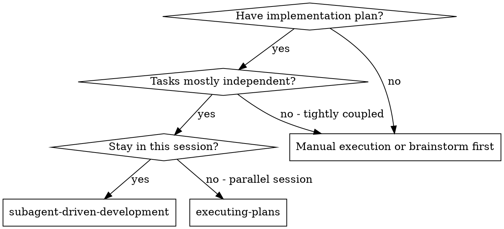
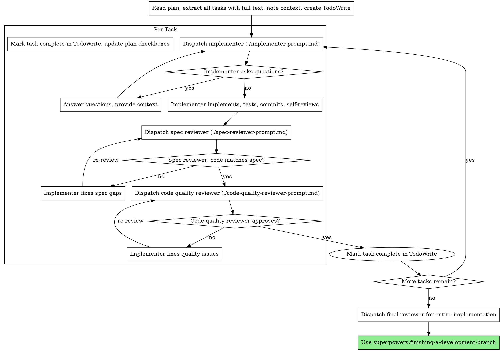

# Subagent-Driven Development

Execute the plan by running **one fresh worker per role/step** (implementer, then spec reviewer, then code quality reviewer), with **two-stage review after each task: spec compliance first, then code quality**.

**Terminology:** This skill says **subagent** and **worker** interchangeably. Both mean the same thing: a **separate agent invocation** that does **not** see your chat history. You paste everything it needs into its prompt.

**Why workers:** Isolated context keeps each role focused. You craft instructions and facts explicitly; the worker does not inherit this session’s prior turns. You stay free for coordination, questions, and plan updates.

**Core principle:** Fresh worker per task + two-stage review (spec then quality) = high quality, fast iteration.

**Fidelity to the plan:** Plans from **superpowers:writing-plans** spell out **whole tasks** — often test-first work, then implementation, then **rules review**, **run checks** (project script or equivalent), **`git commit`**, and any other listed subtasks. The implementer must finish **all** of those steps **before** reporting DONE, not only the edits. The controller must paste the **full task text** into the worker prompt so those obligations are visible. Spec and code-quality reviewers should treat skipped plan-mandated checks or commits as **non-compliance** (same as missing code). If a required command cannot be run, **stop and escalate** instead of silently skipping.

## In Cursor Agent

Cursor has **no** Claude Code “Skill” tool for spawning workers. When this skill says **dispatch** a subagent, do this in Cursor:

1. **You are the controller** — the agent in this chat. You read the plan once, extract tasks, maintain `TodoWrite`, update the plan file, and answer the worker’s questions.
2. **Run a worker with the Task tool** (if your Cursor build exposes it):
   - **Read** the matching prompt template from this folder (`implementer-prompt.md`, `spec-reviewer-prompt.md`, `code-quality-reviewer-prompt.md`), **fill every placeholder**, then pass the **full resulting text** as the Task **`prompt`**.
   - **Subagent types:** Use **`generalPurpose`** for the **implementer**, the **spec compliance** reviewer, and the **code quality** reviewer. You may use **`code-reviewer`** for the code-quality pass **only** when your Cursor build offers it **and** you still pass the **entire filled** `./code-quality-reviewer-prompt.md` as the Task `prompt` (same rubric as in the template — do not rely on a generic built-in review checklist alone).
   - **Description:** Short label only (e.g. `Implement plan task 2: recovery modes`). The **prompt** carries the real instructions.
3. **Never point the worker at the plan file** unless the template explicitly requires it — default is **paste the full task text** into the prompt (same rule as below).
4. **If Task / subagents are not available** in your environment: run the same steps **sequentially in this chat**, but for each role start a **new message block** with a clear role header and paste the filled template again. Treat that as a context-compromise fallback, not the preferred path.

**Claude Code note:** In Claude Code, the same workflow may be triggered via that product’s subagent or task UI; the **process** (fresh worker, filled templates, two reviews) is unchanged.

## When to Use



**vs. Executing Plans (parallel session):**
- Same session for the human (you coordinate here)
- Fresh worker per step (no context pollution between roles)
- Two-stage review after each task: spec compliance first, then code quality
- Faster iteration (no human-in-loop between tasks)

## The Process

In diagrams, **“Dispatch … (./file.md)”** means: **Read** that template, fill it, **Task** with the filled prompt (or sequential role-play fallback above).



## Plan File Updates

Update the plan `.md` file as you go so the human has a persistent progress view even if the agent crashes:
- **When starting a task** — Mark it `[~]` in the plan file
- **When a task is complete** — Mark it `[x]` in the plan file

Commit plan file updates with the task commit or in a separate commit.

## Model Selection

Use the least powerful model that can handle each role to conserve cost and increase speed. In Cursor’s Task tool, set **`model`** when the tool supports it (e.g. a faster model for mechanical work).

**Mechanical implementation tasks** (isolated functions, clear specs, 1–2 files): use a fast, cheap model. Most implementation tasks are mechanical when the plan is well-specified.

**Integration and judgment tasks** (multi-file coordination, pattern matching, debugging): use a standard model.

**Architecture, design, and review tasks**: use the most capable available model.

**Task complexity signals:**
- Touches 1–2 files with a complete spec → cheap model
- Touches multiple files with integration concerns → standard model
- Requires design judgment or broad codebase understanding → most capable model

## Handling Implementer Status

Implementers report one of four statuses. Handle each appropriately:

**DONE:** Proceed to spec compliance review.

**DONE_WITH_CONCERNS:** The implementer completed the work but flagged doubts. Read the concerns before proceeding. If the concerns are about correctness or scope, address them before review. If they are observations (e.g., “this file is getting large”), note them and proceed to review.

**NEEDS_CONTEXT:** The implementer needs information that was not provided. Provide the missing context and **re-run Task** with an updated filled `implementer-prompt.md`.

**BLOCKED:** The implementer cannot complete the task. Assess the blocker:
1. If it is a context problem, provide more context and re-run Task with the same model tier
2. If the task requires more reasoning, re-run Task with a more capable model
3. If the task is too large, break it into smaller pieces
4. If the plan itself is wrong, escalate to the human

**Never** ignore an escalation or force the same model to retry without changes. If the implementer said it is stuck, something needs to change.

## Prompt Templates

For each dispatch: **Read** the template from disk, substitute placeholders, pass the **entire** filled body as the worker **`prompt`**.

- `./implementer-prompt.md` — Implementer worker
- `./spec-reviewer-prompt.md` — Spec compliance reviewer worker
- `./code-quality-reviewer-prompt.md` — Code quality reviewer worker

## Example Workflow

```
You: I'm using Subagent-Driven Development to execute this plan.

[Read plan file once: docs/superpowers/plans/feature-plan.md]
[Extract all 5 tasks with full text and context]
[Create TodoWrite with all tasks]

Task 1: Hook installation script

[Get Task 1 text and context (already extracted)]
[Read implementer-prompt.md, fill placeholders, Task(generalPurpose) with that prompt]

Implementer: "Before I begin - should the hook be installed at user or system level?"

You: "User level (~/.config/superpowers/hooks/)"

[Task again with same template updated with your answer, or next worker turn per template]

Implementer:
  - Implemented install-hook command
  - Added tests, 5/5 passing
  - Self-review: Found I missed --force flag, added it
  - Committed

[Read spec-reviewer-prompt.md, fill, Task(generalPurpose) with that prompt]
Spec reviewer: ✅ Spec compliant - all requirements met, nothing extra

[Read code-quality-reviewer-prompt.md, fill (e.g. include SHAs), Task(code-reviewer or generalPurpose)]
Code reviewer: Strengths: Good test coverage, clean. Issues: None. Approved.

[Mark Task 1 complete]

Task 2: Recovery modes

[Read implementer-prompt.md, fill for task 2, Task(generalPurpose)]
...

[After all tasks: final full-plan review using requesting-code-review / a final filled reviewer prompt]
Done!
```

## Advantages

**vs. Manual execution:**
- Workers follow TDD naturally when the template and plan require it
- Fresh context per task (no confusion)
- Safe serial pattern (one implementer at a time)
- Worker can ask questions (before and during work)

**vs. Executing Plans:**
- Same session for coordination (no handoff)
- Continuous progress (no waiting on a separate thread)
- Review checkpoints are explicit in your loop

**Efficiency gains:**
- No plan-file read inside the worker unless you choose to include an excerpt (default: you paste full task text)
- You curate exactly what context is needed
- Questions surface before deep implementation (when the worker follows the template)

**Quality gates:**
- Self-review catches issues before handoff
- Two-stage review: spec compliance, then code quality
- Review loops ensure fixes actually work
- Spec compliance prevents over/under-building
- Code quality ensures implementation is well-built

**Cost:**
- More worker invocations (implementer + 2 reviewers per task)
- Controller does more prep work (extracting all tasks upfront)
- Review loops add iterations
- Catches issues early (cheaper than debugging later)

## Red Flags

**Never:**
- Start implementation on main/master branch without explicit user consent
- Skip reviews (spec compliance OR code quality)
- Proceed with unfixed issues
- Run **multiple implementer workers in parallel** on the same repo (merge conflicts)
- Make the worker read the plan file instead of pasting the **full task text** (unless the template explicitly directs otherwise)
- Skip scene-setting context (the worker needs to understand where the task fits)
- Ignore worker questions (answer before letting them proceed)
- Accept “close enough” on spec compliance (spec reviewer found issues = not done)
- Skip review loops (reviewer found issues → implementer fixes → review again)
- Let implementer self-review replace actual review (both are needed)
- **Start code quality review before spec compliance is ✅** (wrong order)
- Move to the next task while either review has open issues
- Treat a task as finished while **plan-mandated** steps are missing (rules check, running the plan’s checks, `git commit` when required, etc.)

**If the worker asks questions:**
- Answer clearly and completely
- Provide additional context if needed
- Do not rush them into implementation

**If a reviewer finds issues:**
- Implementer (new Task with updated `implementer-prompt.md` / fix instructions) fixes them
- Reviewer runs again
- Repeat until approved
- Do not skip the re-review

**If the worker fails the task:**
- Run Task again with **narrow fix instructions** (or a smaller scoped task)
- Avoid doing large fix work yourself in the controller session (context pollution and blurs roles)

## Integration

**Required workflow skills:**
- **superpowers:using-git-worktrees** — REQUIRED: Set up isolated workspace before starting
- **superpowers:writing-plans** — Creates the plan this skill executes (plan uses `[ ]`/`[~]`/`[x]` checkboxes — update them in the plan file as tasks progress)
- **superpowers:requesting-code-review** — Code review template for reviewer workers
- **superpowers:finishing-a-development-branch** — Complete development after all tasks

**Workers should use:**
- **superpowers:test-driven-development** — TDD for each task when the plan calls for it

**Alternative workflow:**
- **superpowers:executing-plans** — Use for a parallel session instead of same-session execution

**Cursor tool mapping:** See **superpowers:using-superpowers** → `references/cursor-tools.md` for how other skills’ tool names map in Cursor.
