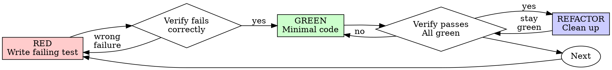

**Refactoring:** When you refactor code that is already tested, e.g. extracting a method from a service that's covered my integration tests, 
do **not** write new tests against the refactored code. 
Run the existing tests before and after the code change to confirm the refactoring didn't change system behavior.

# Test-Driven Development (TDD)

## Overview

Write the test first. Watch it fail. Write minimal code to pass.

**Core principle:** If you didn't watch the test fail, you don't know if it tests the right thing.

**Violating the letter of the rules is violating the spirit of the rules.**

## When to Use

Always: new features, bug fixes, refactoring, behavior changes.

Exceptions (ask human): throwaway prototypes, generated code, configuration files.

## The Iron Law

```
NO PRODUCTION CODE WITHOUT A FAILING TEST FIRST
```

Write code before the test? Delete it. Start over.

**No exceptions:** Don't keep as "reference." Don't "adapt" it while writing tests. Delete means delete.

## Red-Green-Refactor



### RED — Write Failing Test

One minimal test, one behavior, clear name. Use real code. **Mock only at system boundaries** (3rd party services, external APIs)—never project's own code.

```typescript
// Good: tests real behavior
test('retries failed operations 3 times', async () => {
  let attempts = 0;
  const operation = () => { attempts++; if (attempts < 3) throw new Error('fail'); return 'success'; };
  expect(await retryOperation(operation)).toBe('success');
  expect(attempts).toBe(3);
});

// Bad: tests mock, not code
test('retry works', () => { expect(mock).toHaveBeenCalledTimes(3); });
```

### Verify RED — MANDATORY

Run only the **current test file** during TDD for fast feedback (e.g. `npm test path/to/current.test.ts` or project's `check` script with file path). Full suite when task is done.

Confirm: test fails (not errors), failure message expected, fails because feature missing. Test passes? Fix test. Test errors? Fix error, re-run.

### GREEN — Minimal Code

Simplest code to pass. No extra features, no refactoring other code.

**Complex change?** Start with a trivial test (e.g. endpoint returns 200). Make it pass. Extend test, implement. Repeat. Don't write one large test up front.

### Verify GREEN — MANDATORY

Confirm: test passes, other tests pass, output pristine. Test fails? Fix code, not test.

### REFACTOR — After Green Only

Remove duplication, improve names, extract helpers. Keep tests green. Don't add behavior.

## Good Tests

| Quality | Good | Bad |
|---------|------|-----|
| Minimal | One thing | "and" in name = split |
| Clear | Name describes behavior | `test('test1')` |
| Real | Tests code behavior | Tests mock behavior |
| Structure | Setup → call → verify (follow codebase: ARRANGE/ACT/ASSERT or GIVEN/WHEN/THEN) | Setup hidden in beforeEach |
| Expectations | Hardcode expected results | Duplicate calculation logic in test |

**Never duplicate calculation logic in tests.** Fixed inputs, known outputs. Calculating expectations in the test makes both prod and test share the same bug.

**Test structure:** Setup → call → verify. Crucial. Follow codebase comment style (e.g. ARRANGE/ACT/ASSERT); if none, use GIVEN/WHEN/THEN.

## Rationalization Table

| Excuse | Reality |
|--------|---------|
| "Too simple to test" | Simple code breaks. Test takes 30 seconds. |
| "I'll test after" | Passing immediately proves nothing. |
| "Tests after achieve same goals" | Tests-after = "what does this do?" Tests-first = "what should this do?" |
| "Already manually tested" | Ad-hoc ≠ systematic. No record, can't re-run. |
| "Deleting X hours is wasteful" | Sunk cost. Keeping unverified code is debt. |
| "Keep as reference" | You'll adapt it. Delete means delete. |
| "Need to explore first" | Throw away exploration, start with TDD. |
| "TDD will slow me down" | TDD faster than debugging. |
| "This is different because..." | Rationalization. Start over. |

## Red Flags — STOP and Start Over

- Code before test
- Test passes immediately
- Can't explain why test failed
- "Keep as reference" or "adapt existing code"
- "Tests after achieve the same purpose"
- "It's about spirit not ritual"
- "TDD is dogmatic, I'm being pragmatic"

**All of these mean: Delete code. Start over with TDD.**

## Verification Checklist

- [ ] Every new function has a test
- [ ] Watched each test fail before implementing
- [ ] Each test failed for expected reason (feature missing, not typo)
- [ ] Minimal code to pass
- [ ] All tests pass, output pristine
- [ ] Tests use real code (mocks only at system boundaries)

Can't check all boxes? You skipped TDD. Start over.

## When Stuck

| Problem | Solution |
|---------|----------|
| Don't know how to test | Write wished-for API. Assertion first. Ask human. |
| Test too complicated | Design too complicated. Simplify interface. |
| Must mock everything | Code too coupled. Dependency injection. |
| Non-deterministic code (Date, random, uuid) | Wrap in injectable (Clock, etc.), use fixed impl in tests |
| Test setup huge | Extract helpers. Still complex? Simplify design. |

## Bug Fixes

Bug found? Write failing test reproducing it. Follow TDD cycle. Never fix bugs without a test.

## Frontend Testing

Frontend tests tend to be slower and flakier than backend. Extract logic to pure functions (unit test those). Use condition-based waiting (`waitFor`, `findBy`) instead of fixed timeouts. Mock at boundaries (API, timers). Refine based on experience—this guidance is less battle-tested than backend.

## Testing Anti-Patterns

When adding mocks or test utilities, read @testing-anti-patterns.md:
- Never mock project's own code—only at system boundaries
- Non-deterministic code (Date, random, uuid)—wrap in injectable
- Frontend: extract logic, condition-based waiting, mock at boundaries
- Testing mock behavior instead of real behavior
- Test-only methods in production classes
- Duplicating calculation logic in tests (hardcode expected results)

## Final Rule

```
Production code → test exists and failed first
Otherwise → not TDD
```
